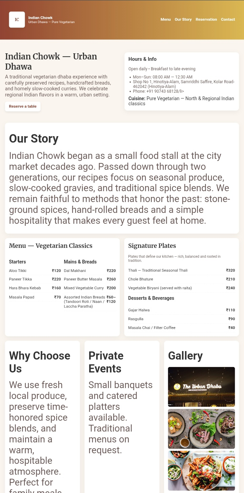

# Restuarant-website-
Restuarant blog page website 
# 🍽️ Indian Chowk — Urban Dhawa

A modern **vegetarian restaurant blog-style website** built using **HTML, CSS, and JavaScript**.  
It highlights a traditional dhaba experience blended with a contemporary web design — perfect for restaurants that value authentic taste and warm hospitality.

---

## 📸 Screenshot


👉 **Live Website:** [Click to Visit](https://bharat-codie.github.io/Restuarant-website-/)

---

## 🧾 About the Website

**Indian Chowk — Urban Dhawa** celebrates traditional Indian vegetarian recipes with handcrafted breads, slow-cooked curries, and homely flavors.  
This website layout is inspired by dhaba culture, featuring a warm tone, elegant typography, and clean section design for a professional online presence.

---

## ✨ Features

- 🍛 Clean & Modern Restaurant Layout  
- 📜 Menu section with pricing and food categories  
- 🕒 Hours & Info section (open/close time, location, contact)  
- 🧭 Smooth navigation bar (Menu | Our Story | Reservation | Contact)  
- 📍 Embedded Google Map support (for location)  
- 📱 Fully Responsive for mobile & desktop  
- 📷 Gallery and About sections  
- 🌿 Pure Vegetarian theme  

---

## ⚙️ Tech Stack

- **HTML5** – Structure  
- **CSS3** – Styling & responsiveness  
- **JavaScript** – Interactivity  
- **GitHub Pages** – Hosting  

---

## 📂 Sections Overview

| Section | Description |
|----------|--------------|
| **Home** | Header, brand intro, and call-to-action button |
| **Our Story** | Restaurant history and mission |
| **Menu** | Full vegetarian menu with prices |
| **Gallery** | Realistic food images and ambience |
| **Contact / Reservation** | Easy access for customers to connect |

---

## 🧠 How to Use

1. Clone the repository:
   ```bash
   git clone https://github.com/bharat-codie/Restuarant-website-.git
   
